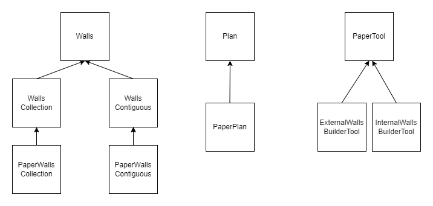

## Groupe

Projet réalisé en trinôme :

- Mikhail GAYDAMAKHA
- Hejer BOUZOUITA
- Walid MORSLI

## Compte rendu

Pour réaliser le travail demandé, nous avons opté pour une architecture basée sur la philosophie du design pattern MVC (légèrement modifié dans notre cas), qui nous a aidé à structurer notre code et pouvoir répondre aux evénements de l'utilisateur en suivant le flux model-view-controller. Nous avons aussi mis en oeuvre le couplage faible à l'aide du design pattern stratégie afin de faciliter l'integration des nouvelles modifications/extensions au système sans avoir besoins de toucher au fonctionnel existant.

Ci-dessus deux diagrammes qui illustrent les deux conceptes mentiionnés au-dessus :

Fonctionnalités :

- Tracer l'enceinte extérieure du bâtiment.
- Tracer les murs intérieurs du bâtiment.
- Revenir en arrière et pouvoir supprimer des murs avec la combinaison Ctrl + Z.

Ci-dessus la liste des fichiers contenant les modification que nous avons apporté au code initial :

- `app`
- `point`
- `walls`
- `contiguous-walls`
- `walls-collection`
- `paper-contiguous-walls`
- `paper-walls-collection`
- `plans`
- `paper-plans`
- `external-wall-builder-tool`
- `internal-wall-builder-tool`

## Seed Paper.js

Cours d'architecture — Programmation orientée objet

## Technologies

Voici la liste des technologies mises en jeu :

- [Node](https://nodejs.org/en), un [runtime](https://fr.wikipedia.org/wiki/Environnement_d%27ex%C3%A9cution)
  JavaScript, mais pas dans un navigateur. Il vous permettra d'installer les dépendances nécessaires et de compiler le
  projet.

- [yarn](https://yarnpkg.com), un gestionnaire de dépendances JavaScript (alternative généralement plus robuste et
  rapide à npm).

- [Webpack](https://webpack.js.org), un bundler JavaScript, il permet de compiler votre projet dans quelque chose qui
  puisse s'ouvrir dans un navigateur web.

- [TypeScript](https://www.typescriptlang.org), un superset de JavaScript qui ajoute à ce dernier du
  [typage structurel](https://en.wikipedia.org/wiki/Structural_type_system).
  Il se compile en JavaScript pur (au runtime, les types n'existent plus, les seules vérifications se passent à la
  compilation !).

- [Paper.js](http://paperjs.org/about), une librairie de manipulation de graphiques vectoriels, qui effectue son rendu
  sur [canvas](https://developer.mozilla.org/fr/docs/Web/API/Canvas_API).

## Installation

- Installer [Volta](https://volta.sh/), un gestionnaire de versions pour Node, yarn et npm.
  - Note : Si vous avez déjà Node et yarn sur votre machine, vous pouvez vous en passer du moment que tout fonctionne.
  - Désormais, quand vous ouvrirez le dossier du projet dans un terminal, volta devrait automatiquement télécharger les
    bonnes versions de node et npm. Testez en tapant `node --version` par exemple.
- Exécuter `yarn install` pour installer les dépendances listées dans le fichier `package.json`.

## Lancer l'application

- En développement, pour bénéficier de la recompilation et du rechargement automatique quand on modifie un fichier
  source, utilisez **`yarn serve`**.

  - Cette commande ouvrira automatiquement votre application dans votre navigateur par défaut sur,
    http://localhost:8080/.
  - Pour couper le serveur une fois lancé, on utilise CTRL+C comme pour toute autre commande, ou bien l'on ferme le
    terminal.

- Pour compiler l'application de manière statique, lancez **`yarn build`**.
  - Le résultat se trouvera dans `dist/`. C'est ce qu'on uploaderait sur un serveur en ligne si l'on voulait rendre notre
    application publique.

## Structure du projet

Si vous êtes peu familier avec le développement web moderne...

- `src` C'est le répertoire principal des sources de l'application. Rien de ce qui constitue l'application ne devrait
  se trouver en dehors.
  - `index.html` Fichier HTML hébergeant notre canvas pour paper.js, et incluant le fichier JavaScript généré par
    Webpack (qui intégrera lui-même la balise `<script>` nécessaire !).
  - `index.ts` Point d'entrée de l'application. Vous pouvez charger d'autre fichiers TypeScript à partir de celui-là, à
    l'aide d'imports.
- `.gitignore` Spécifie les fichiers propres à votre machine (résultat de compilation, dépendances installées, etc) que
  Git ne doit pas inclure dans le dépôt.
- `package.json` Contient la liste des dépendances JavaScript, plus un peu de configuration comme les commandes
  `yarn build` et `yarn serve`.
- `tsconfig.json` Contient la configuration pour le compilateur TypeScript. On peut y modifier quelque peu le
  comportement du langage et du compilateur.
- `webpack.config.js` Contient la configuration Webpack nécessaire pour compiler le projet.
- `yarn.lock` est un fichier autogénéré dérivé des dépendances indiquées dans `package.json`, permettant à chaque
  personne travaillant sur le projet d'utiliser exactement les mêmes dépendances, assurant ainsi des comportements
  reproductibles.
